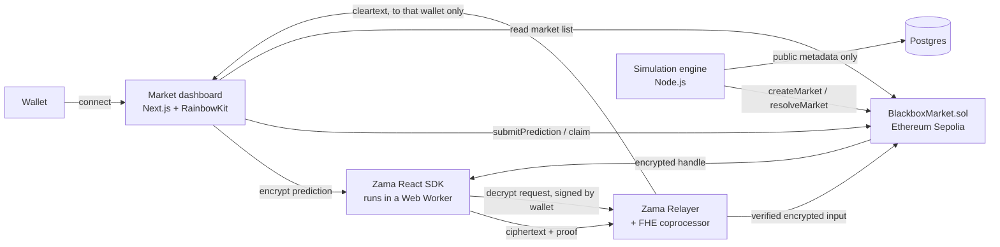

# BLACKBOX

The first confidential prediction market powered by Fully Homomorphic Encryption. Your prediction, your prediction amount, and your outcome share stay encrypted end to end — visible only to you, never to other participants, never to the protocol, never to the chain itself.

Built for the Zama FHE Developer Program, Mainnet Season 3, Builder Track.

Footer credit on every page: Powered by Zama FHE · Developed by Deeen_Codes.

## The problem

Every prediction market built on a public blockchain has the same structural flaw: the moment a position lands on chain, everyone can see it. A large position signals conviction and gets front-run or copied before it settles. A history of positions reveals a participant's strategy to anyone willing to look. The result is a market that rewards whoever is fastest at reading other people's mempool activity, not whoever has the best-researched view of the outcome — close to the opposite of what a prediction market is supposed to reward.

That tradeoff is fine where transparency is the point. It's a dealbreaker where it isn't: a participant with a genuine, maybe contrarian, view of an outcome currently has no way to act on it without broadcasting that view to every other participant, instantly, for free.

## The solution

BLACKBOX is confidential prediction infrastructure. A market has a fixed set of outcomes and fixed, public odds, set when the market is created. Participants submit an encrypted outcome choice and an encrypted prediction amount in a single transaction. Nothing about either value is ever decrypted on chain. Once a market resolves, each participant computes their own encrypted outcome share and privately decrypts it themselves — no one else, including the protocol, ever sees it.

The first market generator is virtual football: a simulated match between BLACK FC and GOLD FC, producing a Winner market and a Total Goals Over/Under market per fixture, settled by a commit-reveal randomness model anyone can independently verify after the fact (see [Architecture](#architecture)). The generator layer is intentionally swappable — esports, AI competitions, or financial scenarios can sit on top of the same confidential market engine later.

This project avoids "bet," "stake," and "gamble" throughout the code, contracts, and copy, on purpose. The product is confidential prediction infrastructure, not a gambling product. The vocabulary used instead: **position, prediction amount, market participation, outcome share.**

## Why FHE

Public blockchains make every position visible the moment it lands on chain. Zama's FHEVM lets a smart contract compute directly on encrypted values, so the contract can validate a prediction, settle a market, and pay out a claim without ever decrypting the participant's choice or amount to anyone but that participant. The market logic — comparing a prediction against the resolved outcome, computing a payout — runs entirely on ciphertext. The only thing that's ever decrypted is a participant's own outcome share, by that participant, after they explicitly authorize it with their own wallet signature.

## Architecture



| Package | Stack | Role |
|---|---|---|
| `contracts/` | Hardhat, Solidity, Zama fhEVM, OpenZeppelin | `BlackboxMarket.sol` — market creation, encrypted prediction submission, resolution, encrypted claim settlement |
| `frontend/` | Next.js, TypeScript, wagmi, RainbowKit, `@zama-fhe/sdk` / `@zama-fhe/react-sdk` | Market dashboard and the full connect → encrypt → submit → claim → decrypt flow |
| `backend/` | Node.js, TypeScript, Postgres | Operator-side virtual football engine: commits randomness, creates markets, resolves them, publishes the public (non-financial) record |

Each package has its own `package.json`, lockfile, and independent dependency tree — the root `package.json` only wires up convenience scripts via `npm --prefix`.

Two design choices worth knowing before reading the code:

- **Fixed odds, not pari-mutuel.** FHEVM can divide an encrypted value by a plaintext divisor, but not by another encrypted value — a shared-pool payout model would need to divide by the sum of all winning amounts, which would mean revealing that sum. Fixed odds avoids this: a payout is `amount × odds`, where the amount is encrypted and the odds are public, set once at market creation.
- **The operator is a trusted role**, separate from contract ownership. It creates and resolves markets — see [SECURITY.md](./SECURITY.md) section 3 for the explicit centralization tradeoff that comes with that, and what closing it would take.

## Demo

A 3-minute judging walkthrough, with talking points and exact steps, is in **[DEMO.md](./DEMO.md)**.

Quick version, once a contract is deployed and the engine is running ([Setup](#setup) below):

1. Open the frontend, connect a wallet on Sepolia.
2. Open a market, pick an outcome, enter a prediction amount, hit encrypt and submit. Watch your browser construct the ciphertext before anything reaches the network.
3. Once the engine resolves the market, return, hit claim, then authorize and decrypt. Only your own browser, with your own wallet's signature, ever sees the result.

## Setup

Requires Node.js 20+ (even-numbered major version — Hardhat does not support odd-numbered Node versions).

```bash
git clone <this-repo>
cd blackbox

# Contracts
cd contracts && npm install && cd ..

# Frontend
cd frontend && npm install && cd ..

# Backend
cd backend && npm install && cd ..
```

### Contracts

```bash
npm run contracts:compile      # compile all Solidity sources
npm run contracts:test         # run the FHEVM mock-mode test suite
npm run contracts:node         # start a local FHEVM-ready Hardhat node
npm run contracts:deploy:local # deploy to the local node (run in a second terminal)
```

To deploy to Sepolia later, set Hardhat configuration variables once:

```bash
cd contracts
npx hardhat vars set MNEMONIC
npx hardhat vars set INFURA_API_KEY
```

### Frontend

```bash
cp frontend/.env.example frontend/.env.local
# NEXT_PUBLIC_WALLETCONNECT_PROJECT_ID from https://cloud.walletconnect.com
# NEXT_PUBLIC_MARKET_CONTRACT_ADDRESS from your BlackboxMarket deployment
# NEXT_PUBLIC_RPC_URL defaults to a placeholder Sepolia URL -- replace it
npm run frontend:dev
```

The frontend targets Sepolia: that's where the deployed contract and Zama's hosted relayer both need to live for the encrypt/submit/claim/decrypt flow to actually work. No relayer API key or backend proxy is needed for Sepolia -- only the mainnet-hosted relayer requires one.

### Backend

The backend is the operator-side virtual football engine: it must hold the private key configured as `BlackboxMarket`'s `operator` address, since `createMarket` and `resolveMarket` both revert for any other caller.

```bash
# 1. start a local database (see below)
cd backend && docker compose up -d && cd ..

# 2. start a local chain and deploy contracts, in a separate terminal
npm run contracts:node
npm run contracts:deploy:local   # note the printed BlackboxMarket address

# 3. configure the engine
cp backend/.env.example backend/.env
# fill in OPERATOR_PRIVATE_KEY (the deployer's key when running locally,
# since the deployer is the default operator) and MARKET_CONTRACT_ADDRESS

# 4. run it
npm run backend:dev
```

The engine settles whatever fixture is due, then creates a new one whenever none is pending — by design, only one fixture is in flight at a time. Each tick is logged with the fixture id, the on-chain market ids, the published randomness commitment, and the closing time.

```bash
npm --prefix backend test   # unit tests: randomness, simulation, engine orchestration
npm --prefix backend run lint
```

### Local database

```bash
cd backend
docker compose up -d
```

This starts Postgres, bound to localhost only, with `schema.sql` applied. The schema only stores public market metadata, simulation history, and participation activity — never a participant's prediction, amount, or position. That data exists exclusively as encrypted state on chain, governed by the FHEVM Access Control List. The one piece of data that's deliberately private even from this database is a pending fixture's randomness seed: it lives only in the engine's memory until the fixture settles, at which point the reveal is written to `simulation_events` (see `backend/src/fixtures/pendingStore.ts` for why).

## Roadmap

1. **Foundation** — done.
2. **Confidential market smart contract** — done. Market creation, encrypted prediction submission, `FHE.eq` / `FHE.select` settlement logic, ACL-gated decryption.
3. **Virtual event engine** — done. Commit-reveal randomness, the virtual football generator, fixture orchestration, settlement submission to the contract.
4. **Frontend experience** — done. Landing page, market dashboard, the connect → encrypt → submit → claim flow.
5. **Security and improvements** — done. Full adversarial review, see [SECURITY.md](./SECURITY.md). Access control, replay, invalid-input, and failed-transaction review; gas, UX, and error-message passes.
6. **Competition polish** — done. This README, [DEMO.md](./DEMO.md), and a root [LICENSE](./LICENSE).

Beyond the hackathon scope, in rough priority order:

- A confidential token standard for real value custody (escrow on submit, payout on claim) — deliberately left out of the market contract itself; see the Architecture section and `BlackboxMarket.sol`'s design notes for why.
- A timelock, multisig, or optimistic dispute window around market resolution, to reduce the single-operator trust assumption documented in SECURITY.md.
- A durable (not in-memory) store for a pending fixture's secret seed, so an engine restart can't lose it.
- Additional market generators (esports, AI competitions, financial scenarios) on top of the existing confidential market engine — no contract changes needed, just a new generator package alongside `virtualFootball`.

## Build verification log

Every phase below was independently built and verified — compiled, tested, linted, and where possible run live against real infrastructure (a real local Hardhat node, a real local Postgres instance) rather than just reasoned about. Full security findings live in [SECURITY.md](./SECURITY.md); this section is the phase-by-phase record of what was checked and what was deliberately left out at each step, and why.

<details>
<summary><strong>Phase 1 — Foundation: complete</strong></summary>

This phase set up the three packages and verified each one independently, with nothing faked or skipped:

| Check | Result |
|---|---|
| Hardhat + Zama FHEVM Solidity compiles | Pass — `npm run contracts:compile` compiles against `@fhevm/solidity` and OpenZeppelin |
| Next.js frontend builds | Pass — `npm run frontend:build` produces a static-optimized production build |
| Frontend lint | Pass — zero ESLint warnings |
| Backend TypeScript builds and runs | Pass — `npm run backend:build && npm --prefix backend start` |

</details>

<details>
<summary><strong>Phase 2 — Confidential market smart contract: complete</strong></summary>

`contracts/contracts/BlackboxMarket.sol` is the core protocol contract. A market has a fixed number of outcomes and a fixed, public payout multiplier per outcome (fixed odds, not pari-mutuel — see the contract's NatSpec `@dev` block for why). Participants submit an encrypted outcome choice and an encrypted prediction amount in one transaction; nothing about either value is ever decrypted on chain. After the operator resolves a market with the actual outcome, each participant calls `claim` to compute their own encrypted outcome share — `amount * oddsForThePredictedOutcome` if correct, zero otherwise — using `FHE.eq`, `FHE.select`, and encrypted arithmetic throughout. Only the participant who submitted a position can decrypt their own prediction, amount, or outcome share off chain; the contract grants that permission explicitly via the FHEVM Access Control List and never grants it to anyone else.

| Check | Result |
|---|---|
| Compiles | Pass — `npm run contracts:compile` |
| Unit, edge case, and permission tests | Pass — 35 tests covering creation, submission, resolution, claiming, and confidentiality (38 total across the package, including the Phase 1 reference contract) |
| Test coverage of BlackboxMarket.sol | 100% functions, 100% statements, 100% branches — `npm --prefix contracts run coverage` |
| Lint (Solidity + TypeScript + Prettier) | Pass — `npm --prefix contracts run lint` |
| Local deployment | Pass — deploys cleanly alongside the Phase 1 reference contract |

What Phase 2 deliberately leaves out, and why: the contract does not move real value yet. `amount` and `outcomeShare` are abstract encrypted units, not an escrowed token balance. Wiring them to a real confidential asset needs a confidential token standard with its own mint/transfer/balance checks, which is a distinct audit surface from the market logic itself — bolting it on here would have made this phase's contract harder to verify cleanly, not easier. It remains future work; see Roadmap.

</details>

<details>
<summary><strong>Phase 3 — Virtual event engine: complete</strong></summary>

The backend (`backend/src/generators/virtualFootball`, `backend/src/fixtures`, `backend/src/engine.ts`) is the first market generator: a virtual football match between BLACK FC and GOLD FC, producing a Winner market (home / draw / away) and a Total Goals Over/Under 2.5 market for every fixture.

The randomness model is commit-reveal:

1. Before creating a fixture's markets, the engine generates a secret 32-byte seed and publishes only its keccak256 commitment — never the seed itself.
2. The two markets are created on chain with that commitment recorded alongside them in `simulation_events`, with a shared closing time.
3. Once the markets close, the engine reveals the seed, deterministically recomputes the match (an independent Poisson goals model with a mild home advantage), and submits the resulting outcome to both markets via `BlackboxMarket.resolveMarket`.
4. Anyone can independently verify the engine didn't change its mind after seeing positions: hash the revealed seed and check it matches the commitment published before the market closed, then re-run the same simulation function on the revealed seed and check it produces the outcome that was actually submitted on chain.

This was verified for real, not just unit-tested in isolation: a live local Hardhat node, a live local Postgres instance, and the actual engine code ran one full fixture lifecycle end to end — commitment published, both markets created on chain, markets closed, seed revealed, outcome resolved on chain — and every step was independently re-checked afterward (the revealed seed was re-hashed and matched the published commitment; the simulation was re-run from the revealed seed in a separate process and reproduced the exact outcome that had been submitted on chain).

| Check | Result |
|---|---|
| Compiles | Pass — `npm run backend:build` |
| Lint | Pass — `npm --prefix backend run lint` (zero warnings; this also fixed a real gap from Phase 1, where the `lint` script existed but ESLint itself was never installed or configured) |
| Unit tests | Pass — 17 tests across randomness (commit/reveal correctness, determinism), simulation (determinism, statistical plausibility over thousands of trials), and engine orchestration (settles only fixtures that are actually due, never runs two fixtures at once) — `npm --prefix backend test` |
| Live end-to-end run | Pass — real Hardhat node + real Postgres + real engine code, full fixture lifecycle, independently re-verified outside the engine afterward |

What Phase 3 deliberately leaves out, and why: the pending fixture's secret seed lives in an in-memory, process-local store (`backend/src/fixtures/pendingStore.ts`) between commitment and reveal, documented there as a known limitation — restarting the engine before a pending fixture settles loses that fixture's seed. This is an acceptable, explicit tradeoff for a hackathon-scale deployment; a production deployment would replace it with a durable private store. The randomness model also does not protect against the operator selectively choosing not to publish a fixture before committing to it, or front-running its own seed before reveal — closing that gap needs a verifiable random function or multi-party reveal; see SECURITY.md.

</details>

<details>
<summary><strong>Phase 4 — Frontend experience: complete</strong></summary>

The frontend (`frontend/src/app`, `frontend/src/components`, `frontend/src/lib`) is a full market dashboard and prediction flow built on Next.js, wagmi, RainbowKit, and Zama's current `@zama-fhe/sdk` / `@zama-fhe/react-sdk`.

- **Landing page** (`/`) carries the required line — "The first confidential prediction market powered by FHE." — and walks through the three-step flow.
- **Market dashboard** (`/markets`) lists every market by reading `nextMarketId` and multicalling `getMarket` for each id. It shows the label, event type, status, and a live countdown to closing. It never shows positions, amounts, or distribution across participants — there is no contract view that exposes those in aggregate, and the UI never queries `getPosition` for anyone but the connected wallet.
- **Market detail page** (`/markets/[id]`) shows the public odds table and walks through the full flow: connect wallet (RainbowKit) → pick an outcome → enter a prediction amount → encrypt both client-side (`useEncrypt`) → submit the transaction (`submitPrediction`) → wait for the market to resolve → claim (`claim`) → privately decrypt the resulting outcome share (`useAllow` once, then `useUserDecrypt`). Only the connected wallet's own prediction, amount, and outcome share are ever decrypted, and only inside that wallet's own browser session.

This phase also involved a real-time architecture correction worth recording: the initial plan (from the original build prompt) was to use `@zama-fhe/relayer-sdk` directly, which was already installed in Phase 1. Researching current Zama documentation while building this phase surfaced that the ecosystem has since moved to `@zama-fhe/sdk` and `@zama-fhe/react-sdk` as the default SDK, specifically because the older SDK's raw WASM imports are fragile under bundlers like Next.js's Turbopack/webpack, where it's a well-documented source of build failures. The newer SDK avoids this by running FHE operations in a Web Worker loaded at runtime rather than bundled directly, and ships a dedicated Next.js SSR guide. The frontend was built against the newer SDK instead, and the old `@zama-fhe/relayer-sdk` dependency was removed.

| Check | Result |
|---|---|
| Production build | Pass — `npm run frontend:build`, including TypeScript checking across all new pages and components |
| Lint | Pass — `npm --prefix frontend run lint`, zero warnings |
| Dev-server route smoke test | Pass — `/`, `/markets`, and `/markets/[id]` all verified to return 200 with correct content and the FHE SDK's required `Cross-Origin-Opener-Policy` / `Cross-Origin-Embedder-Policy` headers actually present on responses |
| Malformed input handling | A market id that isn't a number (`/markets/abc`) was found to crash the page with an unhandled `BigInt()` exception during this build; fixed and re-verified to render a clean message instead |
| React correctness | Two render-time side effects (calling a transaction-success callback during render instead of in `useEffect`) were found and fixed during this build, including making sure the callback passed down from the parent page has a stable reference so the effect doesn't re-fire on every parent render |

What Phase 4 cannot verify in this environment, and why: there is no real browser, real wallet extension, or live Sepolia deployment available here, so the actual encrypt → submit → decrypt round trip against the real Zama relayer has not been exercised end to end the way Phase 3's backend lifecycle was. Everything that doesn't require a live browser and a live testnet -- the build, the type-checking, the lint, the route rendering, the malformed-input handling -- was verified directly. The SDK usage itself was written against the current, official Zama documentation and cross-checked line by line against the actual type declarations shipped in the installed package, not against assumed or remembered API shapes.

</details>

<details>
<summary><strong>Phase 5 — Security and improvements: complete</strong></summary>

A full adversarial review across the contract, the backend, the frontend, and infrastructure config. Two High findings, both real failure-mode bugs rather than exploits requiring an attacker: `settleFixture` and `createFixture` weren't safe to retry after a partial failure, and an ordinary RPC hiccup was enough to permanently strand a market or silently orphan one on chain. Both fixed and covered by new tests that assert the specific compounding behavior doesn't happen anymore. Also found and fixed a real gas inefficiency in `claim()` -- it was doing `O(outcomeCount)` encrypted comparisons to compute something that only needed one, verified with an exhaustive correctness check and a real before/after gas measurement (46.8% reduction on a 3-outcome market, and the new version no longer scales with outcome count at all).

Full findings, severities, exploitation scenarios, and what was reviewed-and-accepted rather than fixed: see **[SECURITY.md](./SECURITY.md)**.

| Check | Result |
|---|---|
| Contracts: tests | Pass — 41 passing (35 existing + 3 new string-length tests + the rest unaffected by the claim() rewrite, which produces byte-identical behavior, proven both mathematically and by the unchanged test suite) |
| Contracts: coverage | 100% functions, statements, and branches maintained on `BlackboxMarket.sol` after the changes |
| Contracts: lint | Pass — Solidity, TypeScript, and Prettier all clean |
| Backend: tests | Pass — 23 passing (17 existing + 4 new `settleFixture` idempotency tests + 2 new engine halt-behavior tests, replacing the prior loop-based claim coverage that's no longer applicable) |
| Backend: lint, build | Pass, zero warnings |
| Frontend: build, lint | Pass, zero warnings, re-verified with a live dev-server route smoke test after the amount-validation and network-banner changes |
| Live end-to-end re-verification | Pass — a real local Hardhat node, a real local Postgres instance, and the actual (now gas-optimized, now idempotent) engine and contract code ran one full fixture lifecycle end to end after every fix in this phase, not just the unit tests in isolation |
| Dependency audit | Backend: 0 vulnerabilities. Contracts: non-breaking fixes applied (55 → 42 advisories); remainder requires a Hardhat 3.x major upgrade, deferred -- see SECURITY.md section 3. Frontend: two advisories with no non-breaking fix path, neither reachable through this app's own code, recorded as monitored risk. |

</details>

<details>
<summary><strong>Phase 6 — Competition polish: complete</strong></summary>

This README was restructured around what a judge needs first (problem, solution, why FHE, architecture, demo) with the phase-by-phase build log moved here, out of the way but not deleted. Added [DEMO.md](./DEMO.md) — a timed 3-minute walkthrough script — and a root [LICENSE](./LICENSE).

</details>
